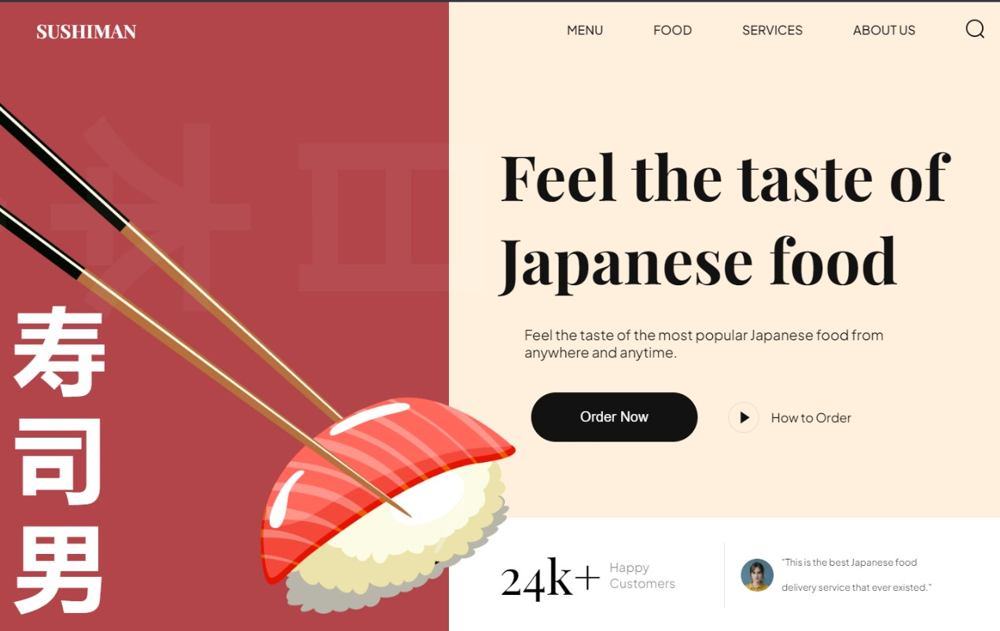
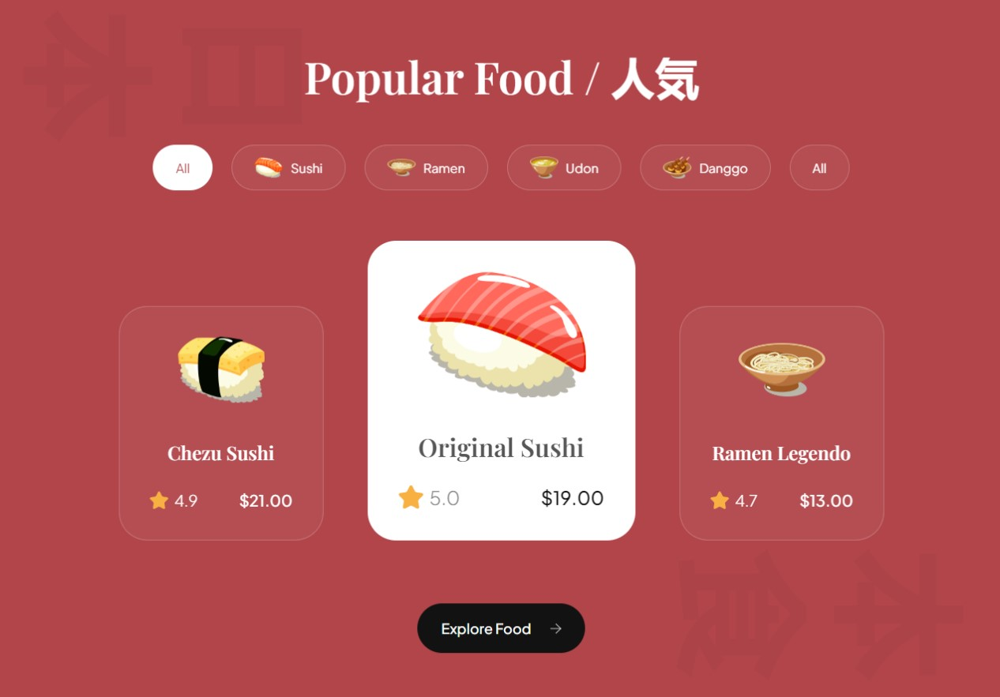

# SushiMan Website

Welcome to the SushiMan website! 🍣 This project is a simple and elegant website dedicated to showcasing the art and flavors of sushi. It's made using HTML, CSS and Javascript.

## Table of Contents

- [Introduction](#introduction)
- [Technologies Used](#technologies-used)
- [Usage](#usage)
- [Contributing](#contributing)

## Introduction

The SushMan website is designed to provide users with a delightful experience exploring the world of sushi. From visually appealing designs to interactive features, the website aims to create a virtual sushi journey for sushi enthusiasts.

## Technologies Used

- **HTML:** Markup language for structuring the website.
- **CSS:** Stylesheets for designing and formatting the website.
- **JavaScript:** Programming language for adding interactivity and dynamic features.

## Usage
- Open the `index.html` file in a web browser to view the website.
- Navigate through the different sections to explore the sushi-themed content.

## Contributing

If you'd like to contribute to the project, feel free to fork the repository and submit a pull request with your changes. We welcome contributions!
